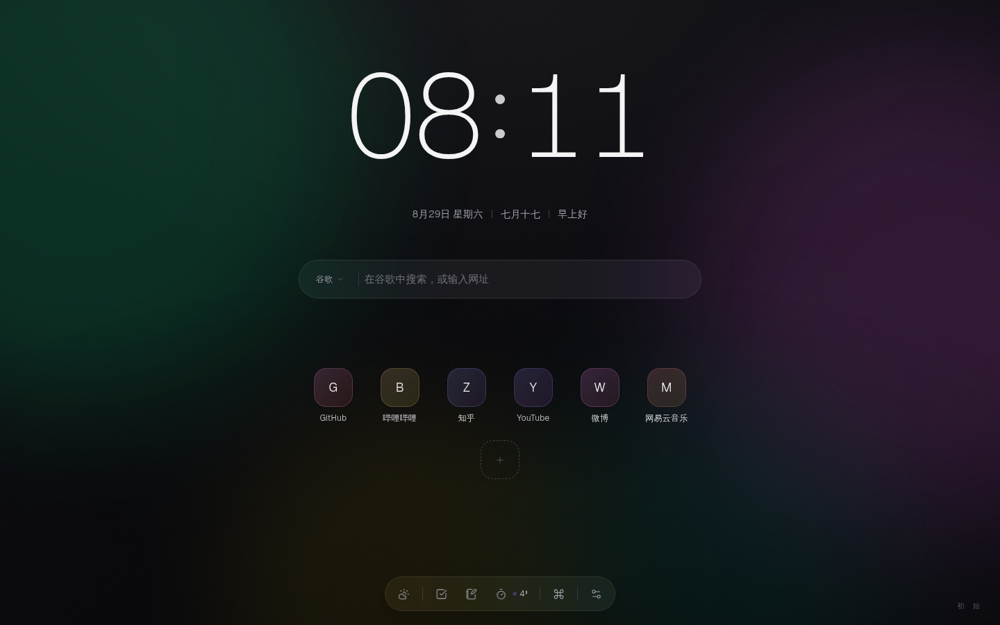
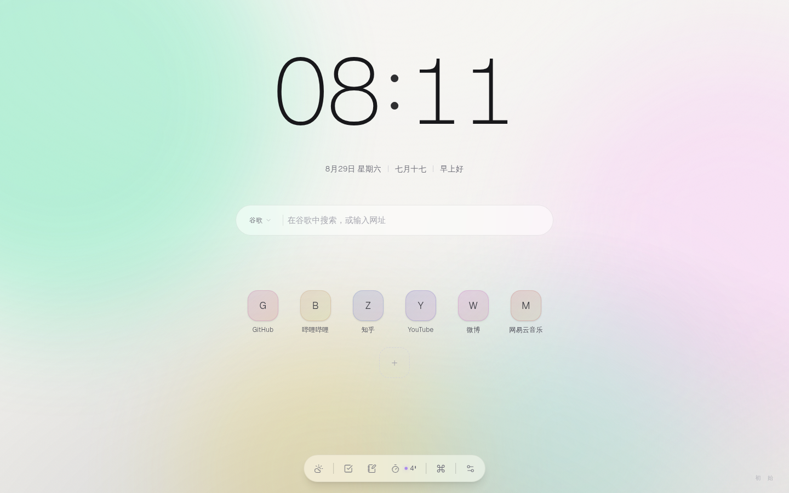

# 初始 · ChuShi 起始页

     

> 一个把「开始新标签页」变成仪式感的浏览器起始页：时钟、搜索、快捷服务、天气、待办、笔记、番茄钟与壁纸图库，全部装进一方极简而克制的画布。

**在线体验**：<https://lxgssy.github.io/Start-chushi/>（GitHub Pages 静态部署，所有数据仅存本地浏览器）



## 这是什么

「初始」是一个纯前端浏览器起始页。它不追求信息堆叠，而是把最高频的几个动作——搜索、打开常用网站、看时间、专注计时——打磨到足够优雅：磨砂玻璃的层次、随动画渐凝渐散的雾化过渡、按壁纸明暗自适应的墨色提示词，以及一个可以完全放空的禅模式。



## 功能特性

- **时钟**：大字极简时钟，附农历与日期
- **搜索**：多引擎切换（搜索引擎在设置中自定义），支持命令面板快速跳转
- **快捷服务**：Dock 栏与快捷链接卡片，长按可编辑、拖拽排序，favicon 运行时加载
- **天气**：天气面板与栏内天气字标（可配置位置）
- **效率套件**：待办清单、速记笔记、番茄钟（正/倒计时、自动阶段轮转、提示音、Dock 徽标）
- **壁纸系统**：
  - 「辉光」动态光斑背景与「纯净」纯色背景
  - 「掠影」官方图库（Unsplash 精选摄影，含国风十帧本地化高清图）
  - 每日一图按日期自动轮换
  - 自定义壁纸（IndexedDB 本地存储，不上传）
- **禅模式**：一键进入只留时钟与呼吸番茄钟的极简视野；进出有雾化散场/聚拢过渡；退出提示词按背景明暗自动切换墨色；番茄钟计时中会以同色系迷你时钟行浮现，停止计时不打扰
- **预设**：声明式 JSON 预设，可给指令面板注册新命令、给底部栏加自定义按钮、批量导入磁贴；进阶玩法还可在预设里携带**沙箱 JS 脚本**（唯一源隔离，拿不到页面数据），写自己的数据源与通知机器人；一段 JSON 复制给朋友，导入即用
- **明暗主题**：跟随系统，也可手动切换
- **动效**：入场、悬浮、进出禅模式全部使用同一套克制的动画语言，并尊重 `prefers-reduced-motion`

## Edge 插件版（新标签页）

同一份代码，以 Chrome MV3 / Edge Add-ons 扩展形态交付：安装后**直接替换浏览器新标签页**，无需打开网址。扩展是完整的本地静态包——时钟、搜索、快捷链接、待办、便签、番茄钟、壁纸图库（含国风十帧）全部随扩展离线分发，**断网也能完整使用**（仅天气、搜索联想、在线壁纸需要网络）。仅支持**桌面版** Edge / Chrome——手机与平板浏览器不允许扩展替换新标签页，移动端请使用下方网页版并「添加到主屏幕」。

### 安装

**方式一 · Edge 商店（已上架）**

在 Microsoft Edge 加载项商店一键安装：**[初始 ChuShi - 新标签页](https://microsoftedge.microsoft.com/addons/detail/bpkdpmdeahplgpcgjakaonlheldagcgf)**（或在商店内搜索「初始」）。首次开启新标签页时浏览器会提示「新的标签页已由此扩展接管」，确认即可。

**方式二 · 开发者模式加载（立即可用）**

1. 从 [GitHub Releases](https://github.com/LXgssy/Start-chushi/releases) 下载最新 `ChuShi-NewTab-v*.zip` 并解压（或直接拖入第 3 步的页面）
2. 打开 `edge://extensions`，开启左下角「**开发人员模式**」
3. 点击「**加载解压缩的扩展**」，选择解压后的文件夹
4. 打开一个新标签页，「初始」即刻呈现

> Chrome / 其他 Chromium 内核浏览器（Chrome、Brave、Opera 等）同样适用，在 `chrome://extensions` 中按相同步骤操作。

### 权限说明

扩展遵循最小权限原则，逐项用途如下（详见 [PRIVACY.md](./PRIVACY.md)）：

| 权限 | 用途 |
|---|---|
| 新标签页覆盖 | 以「初始」替换默认新标签页 |
| `geolocation` | 仅在你主动点击天气「定位」时获取坐标，只用于匹配就近气象站查询天气（扩展版走中国气象局，网页版走 Open-Meteo） |
| `weather.cma.cn` | 中国气象局官方天气（扩展版优先源，请求只含 5 位站号、不含坐标） |
| `api.open-meteo.com` 等 | 天气兜底源 / 城市搜索 / 逆地理编码 |
| `www.baidu.com` | 搜索框输入联想词（仅联想，回车仍用你所选引擎搜索） |
| `images.unsplash.com` | 掠影壁纸在线图库 |

所有偏好、链接、待办、笔记、壁纸依旧只存本地（localStorage / IndexedDB），**无任何上报与追踪**。

## 指令面板（⌘K）

指令面板是「初始」的键盘入口：搜索、面板、操作、预设命令、链接全部汇在一个弹层里。

### 操作须知

| 操作 | 方式 |
|---|---|
| 打开 | `⌘ K`（macOS）/ `Ctrl K`（Windows/Linux）；或底部 Dock 栏最右侧的「指令面板」按钮 |
| 关闭 | 再按一次 `⌘K` / `Ctrl K`，或 `Esc`（逐级关闭：面板 → 对话框 → 侧栏），或点击遮罩 |
| 选择 | `↑` `↓` 移动，`回车` 执行；也支持鼠标直接点击 |
| 过滤 | 直接输入关键词即可模糊匹配；清空后显示全部分组 |

> 提示：在页面空白处**直接打字**会聚焦底部搜索框（而非指令面板）；`/` 键仅聚焦不输入。两者用途不同——搜索框适合「搜出去」，指令面板适合「在本页做事」。

### 面板里有什么

自上而下分组（只显示有内容的分组）：

| 分组 | 何时出现 | 内容 |
|---|---|---|
| 用「…」搜索 | 输入框有内容时 | 全部搜索引擎一键直搜；输入形似网址时还会出现「打开网址」 |
| 打开 | 恒常 | 待办清单 / 便签 / 天气 / 设置面板 |
| 操作 | 恒常 | 切换明暗主题、添加快捷链接、导入 / 管理预设、导出数据备份 |
| 预设命令 | 安装了预设时 | 预设注册的命令（含沙箱脚本注册的），右侧标注来源预设名 |
| 链接 | 有快捷链接时 | 全部磁贴直达（显示域名） |

预设命令与磁贴随预设安装 / 删除即时生效——**装了即出现，删了即消失**，无隐藏状态。

## 预设（自定义你的起始页）

「初始」支持通过 ⌘K 指令面板 →「导入预设」粘贴一段 JSON 来扩展起始页。**声明式部分**（命令 / 磁贴 / 按钮 / 设置）不执行任何代码，所有能力走白名单动作；**进阶部分**（`scripts` 沙箱脚本）运行在唯一源隔离沙箱中（见下文）。两者都可以放心安装别人分享的预设。

### 能做什么

| 预设字段 | 效果 |
|---|---|
| `commands` | 往 ⌘K 指令面板注册新命令（≤12 条） |
| `dock` | 给底部栏加自定义按钮（≤3 个） |
| `links` | 批量导入快捷链接磁贴（≤12 个，按网址去重） |
| `settings` | 建议的外观设置（强调色 / 12 小时制 / 显示秒） |
| `scripts` | 沙箱 JS 脚本（≤3 个，每个 ≤8000 字符，v1.0.5 起） |

### 动作白名单（`action`）

| type | 参数 | 效果 |
|---|---|---|
| `open` | `url`（仅 https） | 打开网址 |
| `search` | `engine`（google/bing/baidu/ddg）、`q` | 用指定引擎搜索 |
| `panel` | `id`（weather/todo/note/pomodoro/settings） | 打开内置面板 |
| `theme` | `mode`（light/dark） | 切换主题 |
| `copy` | `text`（≤200 字） | 复制文本到剪贴板 |
| `script` | `id`（本预设内 `scripts[].id`） | 触发脚本入口 `chushi.run`（v1.0.5 起） |

### 示例

在「导入预设」对话框点「填入示例」可直接试玩（含一条沙箱脚本命令）：

```json
{
  "chushi": 1,
  "name": "开发者工具箱",
  "author": "初始",
  "description": "示例预设：命令、磁贴、tab 栏按钮与沙箱脚本",
  "commands": [
    { "title": "打开 GitHub", "action": { "type": "open", "url": "https://github.com" } },
    { "title": "搜索 MDN", "action": { "type": "search", "engine": "bing", "q": "MDN web docs" } },
    { "title": "打开待办", "action": { "type": "panel", "id": "todo" } },
    { "title": "每日一言", "action": { "type": "script", "id": "hitokoto" } }
  ],
  "links": [
    { "name": "MDN", "url": "https://developer.mozilla.org" }
  ],
  "dock": [
    { "title": "GitHub", "icon": "github", "action": { "type": "open", "url": "https://github.com" } }
  ]
}
```

字段写错会被逐条指出（例如 url 不以 `https://` 开头、`script` 引用了不存在的脚本 id），整包拒绝导入，不会装一半。已安装的预设可在「管理预设」中移除，移除后命令与按钮一并消失。

### 沙箱 JS（高阶模式，v1.0.5 起）

想让预设「活」起来——接自己的 API、定时提醒、抓取数据再通知——可以在预设里写 `scripts` 字段。脚本运行在一个**唯一源沙箱**中：

- **网页版**：脚本在 `sandbox="allow-scripts"` 的 iframe 里执行，处于不透明源，**读不到主文档、localStorage、Cookie**；
- **扩展版**：脚本在 manifest `sandbox` 声明的沙箱页里执行，**没有任何扩展 API**（`chrome.*` 不可用），与网页版共用同一份运行时，行为一致；
- 脚本唯一的能力来源是受控 API `chushi`，所有越界副作用都会被宿主复核白名单后才执行。

#### `chushi` API

| API | 说明 |
|---|---|
| `chushi.registerCommand({ id, title, run })` | 往 ⌘K 指令面板注册命令；id 仅限字母 / 数字 / `_` / `-`（≤32 字符），每脚本 ≤12 条 |
| `chushi.run = fn` | 定义脚本入口：预设 `commands` / `dock` 里 `{"type":"script","id":"<脚本id>"}` 触发它 |
| `chushi.notify({ title, description })` | 弹出通知（title ≤24 字、description ≤60 字） |
| `chushi.open(url)` | 打开 https 网址（宿主复核，与声明式 action 同规） |
| `chushi.copy(text)` | 复制文本（≤200 字） |
| `chushi.fetchJSON(url)` | `fetch` + JSON 解析 + 10 秒超时；受目标站点 CORS 约束 |

示例：给 ⌘K 加一条「每日一言」命令，并在底部栏放一个按钮：

```json
{
  "chushi": 1,
  "name": "每日一言",
  "commands": [
    { "title": "来一句每日一言", "action": { "type": "script", "id": "hitokoto" } }
  ],
  "dock": [
    { "title": "一言", "icon": "heart", "action": { "type": "script", "id": "hitokoto" } }
  ],
  "scripts": [
    {
      "id": "hitokoto",
      "name": "每日一言",
      "code": "chushi.run = async () => { const r = await chushi.fetchJSON('https://v1.hitokoto.cn/'); chushi.notify({ title: r.hitokoto, description: '—— ' + (r.from || '佚名') }); };"
    }
  ]
}
```

#### 能力边界与限制

- **拿不到**：页面 DOM、localStorage、Cookie、扩展 API、用户数据——沙箱里只有你的代码和 `chushi`；
- **网络**：`fetch` / `chushi.fetchJSON` 由沙箱直接发起，受目标站点 CORS 约束（自建 API 记得允许跨域）；
- **不能操作起始页界面**：脚本无法改 DOM——这是有意设计：受控 API 是唯一通道，起始页改版不会弄坏你写好的预设；
- **顶层 `await` 可用**：脚本以 async 函数体执行；
- **死循环保护**：启动 4 秒内未完成的脚本会被看门狗自动冻结停用（删除并重新导入预设即可恢复）；
- **容量**：每预设 ≤3 个脚本，每个 ≤8000 字符，每脚本 ≤12 条命令。


## 快速开始

环境要求：Node.js 18+ 与 [bun](https://bun.sh)（或直接使用 npm）。

```bash
# 安装依赖
bun install        # 或 npm install

# 配置数据库连接（Prisma SQLite，相对路径以 prisma/ 为基准）
echo 'DATABASE_URL="file:../db/custom.db"' > .env
# 仓库已自带空库 db/custom.db；如缺表可执行 bun run db:push

# 开发模式（:3000）
bun run dev        # 或 npm run dev

# 生产构建 + 启动
bun run build
bun run start
```

打开 `http://localhost:3000` 即可。起始页功能不依赖数据库；仓库内的 Prisma/shadcn 脚手架保持平台默认配置，未使用的数据表不影响运行。

## 技术栈

| 层 | 选型 |
|---|---|
| 框架 | Next.js 15（App Router）+ React 19 |
| 样式 | Tailwind CSS 4 |
| 动效 | framer-motion + 原生 CSS 动画（磨砂玻璃存活原则） |
| 组件 | shadcn/ui（Radix 系列） |
| 数据 | localStorage（偏好/番茄钟）+ IndexedDB（自定义壁纸） |
| 字体 | Geist（经 next/font 自托管，SIL OFL） |
| 图标 | lucide-react（ISC） |

## 图片来源与致谢

本项目的美，一半来自这些摄影师。**代码以 MIT 许可开源，图片不在此列**——所有摄影作品均来自 [Unsplash](https://unsplash.com)，适用 [Unsplash License](https://unsplash.com/license)（免费用于商业与非商业用途，无需逐案授权；唯不可将其汇编为竞争性图库服务或未经修改单独售卖）。

### 随仓库分发的本地壁纸（`public/gallery/`，国风十帧）

以下十张图已本地化存储于本仓库，特此逐张标明出处（编号与 `src/lib/startpage/gallery.ts` 中的 gallery id 一致）：

| gallery id | 名称 | 摄影师 / 机构 | 原片 |
|---|---|---|---|
| `great-wall-sunrise` | 长城映日 | [Johannes Plenio](https://unsplash.com/@jplenio) | [unsplash.com/photos/e7nDDmyZH54](https://unsplash.com/photos/great-wall-of-china-e7nDDmyZH54) |
| `li-river` | 漓江山水 | [Ekaterina Zlotnikova](https://unsplash.com/@katja_zlotnikova) | [unsplash.com/photos/f_jBvzQIgig](https://unsplash.com/photos/lush-green-karst-mountains-flank-a-winding-river-f_jBvzQIgig) |
| `huangshan-peaks` | 黄山云峰 | [Sherry Xu](https://unsplash.com/@sherry_bird) | [unsplash.com/photos/YNximhgXa9k](https://unsplash.com/photos/a-view-of-a-mountain-range-covered-in-fog-YNximhgXa9k) |
| `palace-turret` | 角楼落日 | [Yilei (Jerry) Bao](https://unsplash.com/@yileijerrybao) | [unsplash.com/photos/zbOLCwA9Fq0](https://unsplash.com/photos/brown-concrete-building-near-green-trees-and-lake-during-daytime-zbOLCwA9Fq0) |
| `yulong-river` | 遇龙河畔 | [Joshua Earle](https://unsplash.com/@joshuaearle) | [unsplash.com/photos/EqztQX9btrE](https://unsplash.com/photos/bamboo-raft-EqztQX9btrE) |
| `bamboo-sea` | 竹海幽篁 | [Keisuke Kuribara](https://unsplash.com/@ksukkuri) | [unsplash.com/photos/2CY5P28RdDI](https://unsplash.com/photos/low-angle-photography-of-green-trees-during-daytime-2CY5P28RdDI) |
| `ink-wash-hills` | 墨韵远山 | [Art Institute of Chicago](https://unsplash.com/@artchicago) | [unsplash.com/photos/vjrzHCu0ONk](https://unsplash.com/photos/a-painting-of-a-landscape-with-a-mountain-in-the-background-vjrzHCu0ONk) |
| `ink-pine-cliff` | 松崖云雾 | [The Walters Art Museum](https://unsplash.com/@thewalters) | [unsplash.com/photos/17cN3tYHJrI](https://unsplash.com/photos/traditional-chinese-ink-painting-of-misty-mountains-and-pine-17cN3tYHJrI) |
| `longji-terraces` | 龙脊绿浪 | [Chopsticks on the Loose](https://unsplash.com/@chopsticksontheloose) | [unsplash.com/photos/_75I7lCDgY8](https://unsplash.com/photos/aerial-view-of-green-mountain-during-daytime-_75I7lCDgY8) |
| `misty-terraces` | 云雾梯田 | [Simonetta Pugnaghi](https://unsplash.com/@pugnaghis) | [unsplash.com/photos/JI0aBYrZgkI](https://unsplash.com/photos/beautiful-rice-terraces-winding-up-a-green-mountainside-JI0aBYrZgkI) |

### 运行时热链的图库壁纸（不随仓库分发）

图库其余十四张以 Unsplash CDN 直链热链加载（仓库仅存 URL 字符串，运行时从 Unsplash 官方 CDN 取图），出处以 CDN 文件地址标明：

| gallery id | 名称 | CDN 出处 |
|---|---|---|
| `mist-lake` | 晨雾湖山 | [photo-1470071459604-3b5ec3a7fe05](https://images.unsplash.com/photo-1470071459604-3b5ec3a7fe05) |
| `lake-glow` | 湖光斜阳 | [photo-1501785888041-af3ef285b470](https://images.unsplash.com/photo-1501785888041-af3ef285b470) |
| `turquoise-canoe` | 青湖独舟 | [photo-1476514525535-07fb3b4ae5f1](https://images.unsplash.com/photo-1476514525535-07fb3b4ae5f1) |
| `green-cliff` | 崖壁青峦 | [photo-1506744038136-46273834b3fb](https://images.unsplash.com/photo-1506744038136-46273834b3fb) |
| `ridge-clouds` | 云海山脊 | [photo-1464822759023-fed622ff2c3b](https://images.unsplash.com/photo-1464822759023-fed622ff2c3b) |
| `sunbeam-ridge` | 山间光柱 | [photo-1469474968028-56623f02e42e](https://images.unsplash.com/photo-1469474968028-56623f02e42e) |
| `forest-path` | 林间幽径 | [photo-1441974231531-c6227db76b6e](https://images.unsplash.com/photo-1441974231531-c6227db76b6e) |
| `pine-mist` | 雾雪松林 | [photo-1418065460487-3e41a6c84dc5](https://images.unsplash.com/photo-1418065460487-3e41a6c84dc5) |
| `golden-field` | 暮野流金 | [photo-1472214103451-9374bd1c798e](https://images.unsplash.com/photo-1472214103451-9374bd1c798e) |
| `coast-dusk` | 海岸暮色 | [photo-1507525428034-b723cf961d3e](https://images.unsplash.com/photo-1507525428034-b723cf961d3e) |
| `ember-dusk` | 烬色黄昏 | [photo-1508739773434-c26b3d09e071](https://images.unsplash.com/photo-1508739773434-c26b3d09e071) |
| `snow-night` | 雪夜星野 | [Benjamin Voros](https://unsplash.com/@benjaminvoros) · [photo-1519681393784-d120267933ba](https://images.unsplash.com/photo-1519681393784-d120267933ba) |
| `galaxy-vault` | 星河天穹 | [photo-1462331940025-496dfbfc7564](https://images.unsplash.com/photo-1462331940025-496dfbfc7564) |
| `city-light` | 城市夜航 | [photo-1477959858617-67f85cf4f1df](https://images.unsplash.com/photo-1477959858617-67f85cf4f1df) |

### 其他资产

- **logo.svg / start.svg**：本项目原创，随 MIT 许可分发
- **快捷服务 favicon**：运行时从 DuckDuckGo 图标服务加载，仓库不含图标文件
- **Geist 字体**：Vercel，SIL Open Font License，经 `next/font` 自托管

> 若您是上述图片的权利人并希望调整署名方式或移除图片，请提 Issue，我们会在第一时间处理。

## 项目结构

```
src/
├── app/                    # 页面入口（单页起始页）
├── components/startpage/   # 时钟/搜索/Dock/面板/禅模式等组件
└── lib/startpage/          # 图库、搜索引擎、农历、天气、亮度采样等纯逻辑
public/gallery/             # 本地化壁纸（全图 + 缩略图）
docs/                       # README 预览图
```

## 档案与更新记录

研发工作日志（多代理开发全过程）与全部运维脚本随开发持续同步至私有档案仓 [LXgssy/Start-chushi-workspace](https://github.com/LXgssy/Start-chushi-workspace)；本公开仓为产品快照，两仓同源（`src/` 与 `public/` 逐字节一致）。

| 日期 | 更新 |
|---|---|
| 2026-09-01 | 档案补全：沙箱 JS 高阶模式（v1.0.5）实现细节补记入工作日志（Task 48），档案与代码快照对齐 |

## 贡献者

| 贡献者 | 角色 |
|---|---|
| **Super Z**（AI 智能体 · [Z.ai](https://z.ai) GLM） | 界面与动效设计、工程实现、发布工程、文档 |
| **[LXgssy](https://github.com/LXgssy)** | 产品发起人、需求定义、验收 |
| **DeepSeek**（AI 智能体 · deepseek-v4-flash） | 档案补全与发布工程（Task 48 工作日志补记、双仓同步） |

后续版本迭代由 Super Z 以作者身份提交署名。

## 许可证

- **源代码**：[MIT License](./LICENSE)
- **摄影图片**：各自适用 [Unsplash License](https://unsplash.com/license)，与代码许可相互独立
- **字体与图标**：SIL OFL / ISC（详见上文）

---

*初始 · 每一次新标签页，都是一次重新开始。*
